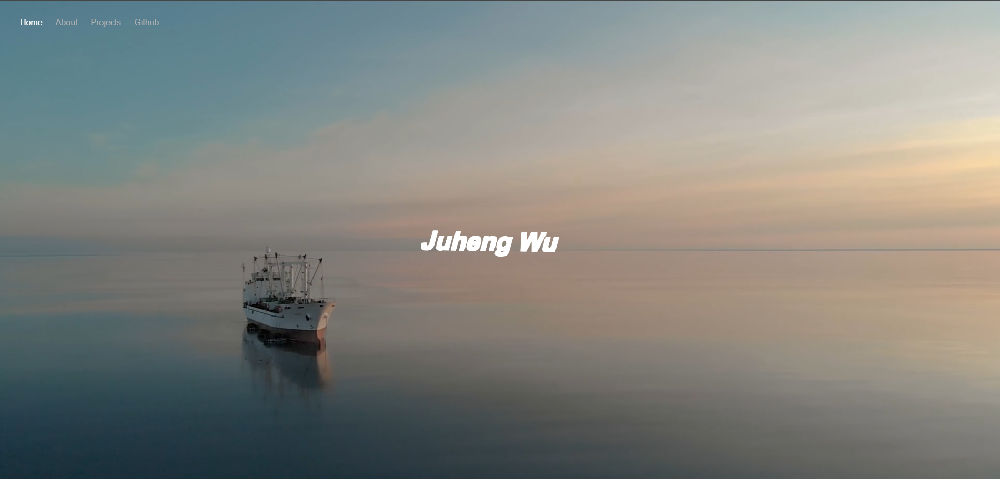

# Juheng Wu - Personal Website

This is the source code for Juheng Wu's personal website, a clean, minimalist, and visually engaging project showcasing video backgrounds and smooth interactions.

## Demo


## Features

- **Video Background:** A full-screen video background enhances the visual appeal of the landing page.
- **Dynamic Logo Interaction:** The logo moves and rotates interactively based on cursor movements, creating a 3D effect.
- **Responsive Navigation:** A responsive navigation menu links to other sections, including external links like a GitHub profile.
- **Customizable Content:** The website includes a placeholder for an introduction or "About Us" section.

## Tech Stack

- **HTML5:** For semantic structure.
- **CSS3:** For styling, animations, and responsiveness.
- **JavaScript:** For interactive and dynamic elements.
- **Assets:** Includes a video background (`Ship.mp4`) and logo image (`juheng.png`).

## Setup Instructions

1. **Clone the Repository:**
   ```bash
   git clone https://github.com/juhengwu/personal-website.git
   cd personal-website
2. **Add Assets:**

- Place your video background (Ship.mp4) in the assets/ folder.
- Place your logo image (juheng.png) in the root directory.
- Open Locally: Open the index.html file in a browser to preview the website.

3. **Deploy: Deploy the website using GitHub Pages:**

- Push the repository to GitHub.
- Go to the repository's settings, enable GitHub Pages, and set the source to the main or docs branch.

## License
This project is open source and available under the MIT License.

## Author
Created by 


